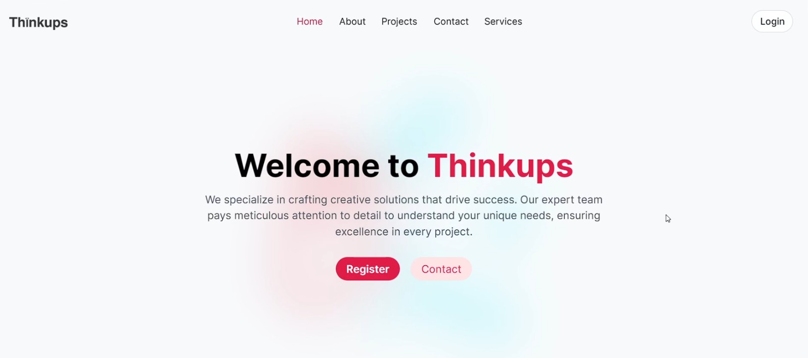

 # ThinkUps

[](https://expressjs.com/)
[](https://nodejs.org/)
[](https://developer.mozilla.org/en-US/docs/Web/JavaScript)
[](https://angular.io/)



A simple angular Website for a Client

### Setup:

1. **Clone the Repository:**
   ```
   git clone https://github.com/HaroonSaifi17/ThinkUps.git
   ```

2. **Install Dependencies:**
   ```
   npm install
   ```

4. **Run the Server:**
   ```
   npm run test 
   ```

5. **Run the Client:**
   ```
   ng serve
   ```

### Contribution:

Contributions are welcome! Feel free to submit pull requests or open issues for any suggestions, bug fixes, or improvements.

### License:

This project is licensed under the MIT License - see the [LICENSE](LICENSE) file for details.
